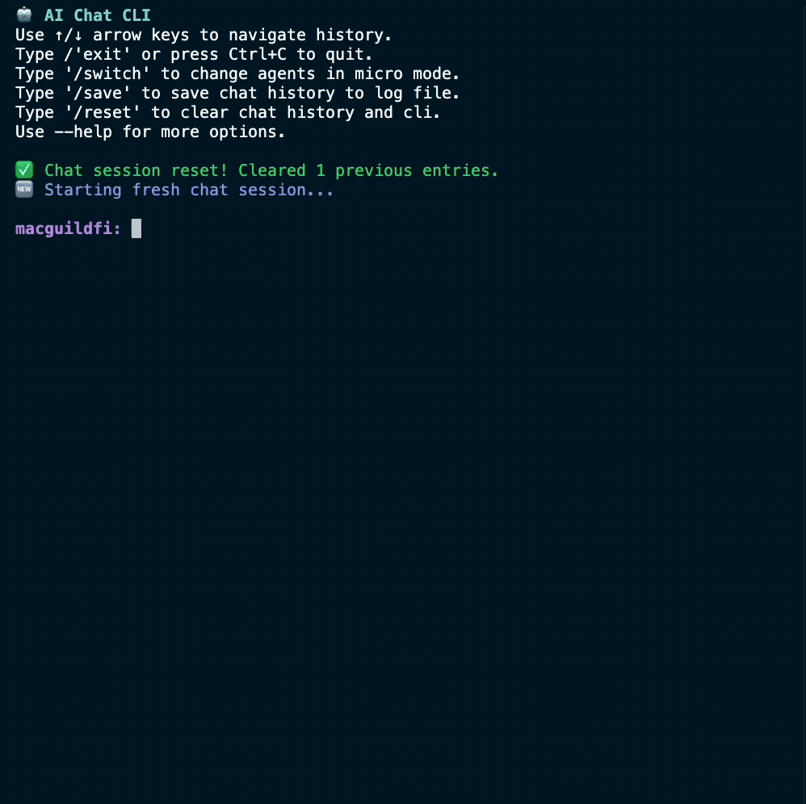

# zAI-CLI

Welcome to `zAI-CLI`! This tool is open for public use -- it's a gateway for accessing `zAI` via the command line.

The terminal connects you directly to the same AI agent that powers [`terminal.zentry.com`](https://terminal.zentry.com) and other internal tools. Feel free to try it out!



# Getting Started

## Installing

Then

```bash
bun install

bun dev
```

# Features

```
bun dev
```

This starts a conversation with history. This is the vanilla AI chat experience everyone is used to.

**Predefined Message Without Prompting**

```
bun dev -m "Your message"
```

This feature sends a message every time you hit refresh. Great for debugging using the same message.

```
bun dev -m "Your messge here"
```

**Ask Mode**

`bun dev -a`

Ask mode sends message without conversation history.

## License
This project is licensed under the [CC BY-NC 4.0 License](https://creativecommons.org/licenses/by-nc/4.0/).

[](https://creativecommons.org/licenses/by-nc/4.0/)