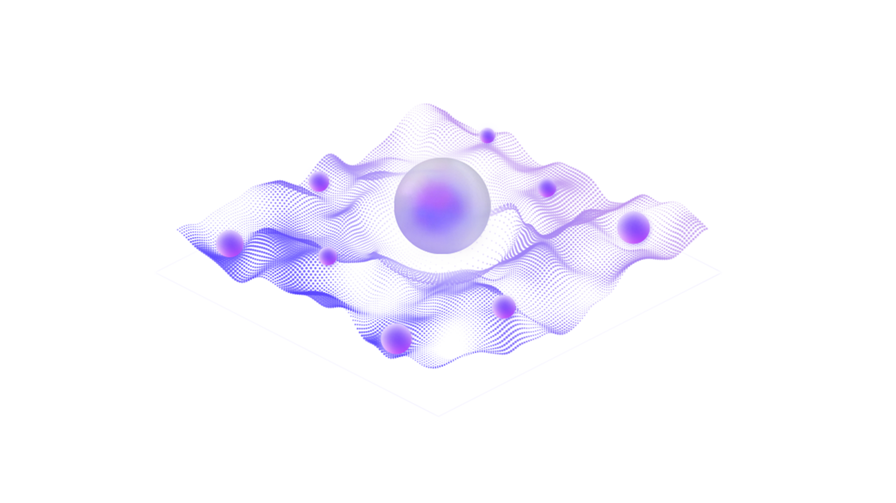

<div align="center">
  
  <h1>zAI CLI</h1>
  <br/>
</div>

Welcome to `zAI CLI`. This command-line tool provides direct access to the `zAI` infrastructure, the same agentic system that powers [`zTerminal`](https://terminal.zentry.com).

`zAI` is the agentic AI layer of Zentry. It functions as a hierarchical system where a primary agent orchestrates specialized micro-agents to perform complex tasks, leveraging a real-time contextual data layer - [`zData`](https://data.zentry.com).

For a comprehensive detail of Zentry AI ecosystem, including the `zApp`, `zAI`, and `zData` layers, please refer to the **[Zentry Whitepaper](http://www.zentry.com/whitepaper)**.

This CLI serves as a developer-oriented tool for interacting with and testing the capabilities of the `zAI`.


---

## The zAI System Architecture

To use this tool effectively, it is helpful to understand the underlying system architecture.

*   **Hierarchical Agent Model:** Your requests are processed by a primary **zAI Agent** that acts as an orchestrator. This agent decomposes your objective into a series of sub-tasks and delegates them to a network of specialized **zAI Micro-Agents**. These micro-agents are modular units with discrete skills, such as crypto data and insight fetching, web interaction, or complex on-chain analysis.
*   **The zData Layer:** `zAI`'s intelligence is enhanced by its native connection to `zData`, a data backbone that provides high-signal context from on-chain, social, and financial domains. Micro-agents query this layer via Model Context Protocols (MCPs) to retrieve the information needed to execute their tasks.
*   **A Tool for Interaction:** The `zAI-CLI` is an interface that allows you to send objectives directly to `zAI`, making the full analytical and operational power of its coordinated micro-agent society available in your terminal.

## Getting Started

### Prerequisites

This project is built with Bun. You will need to have [Bun.js](https://bun.sh/) installed on your system.

### Installation & Running

Clone the repository and install the dependencies:

```bash
# Install the required packages
bun install

# Run the CLI in interactive chat mode
bun dev
```

## Core Features & Usage

### 1. Interactive Chat (Conversation Mode)

This is the standard, stateful chat experience. The agent will maintain the context of your previous messages within the same session.

**Command:**

```bash
bun dev
```

**Use Case:** Useful for iterative exploration of a topic, refining complex questions, and having a continuous dialogue with the agent.

### 2. One-Shot Command (Direct Query)

Send a single, predefined message directly to the agent without entering an interactive session. The command exits after the response is received.

**Command:**

```bash
bun dev -m "Your query or message here"
```

**Use Case:** Efficient for quick, self-contained questions or for integrating `zAI` into scripts where a single response is needed.

### 3. Stateless Query (Ask Mode)

Send a single message without any conversation history. Each query is treated as a new and independent conversation.

**Command:**

```bash
bun dev -a "Your stateless query here"
```

**Use Case:** Recommended for scripting and automated tasks where you need to ensure a response is not influenced by prior interactions.

## Example Use Cases

The following examples demonstrate how to leverage `zAI`'s access to the `zData` layer for specific crypto-related queries.

**Example 1: Analyze a Market Event**

```bash
bun dev -m "Analyze the on-chain volume for the ZENT token in the last 24 hours and correlate it with any significant mentions on X."
```

**Example 2: Get a Snapshot of Community Sentiment**

```bash
bun dev -a \
  "What is the current community sentiment around EIP-4844 based on developer forums and crypto Twitter?"
```

**Example 3: Summarize Recent News**

```bash
bun dev -m \
  "Give me a summary of the latest institutional news regarding spot Bitcoin ETF applications from the past week."
```

## Future Development

The `zAI CLI` is an evolving tool. Future planned features include:
-   **Piping Support:** `cat my_data.json | zai-cli` for context-aware analysis of local files.
-   **Structured Output:** `--json` flag to guarantee JSON-formatted output for easier integration with other tools.
-   **Direct Skill Invocation:** The ability to directly command the `zAI` to use specific Micro-Agent skills.

## License

This project is licensed under the [Creative Commons Attribution-NonCommercial 4.0 International License](https://creativecommons.org/licenses/by-nc/4.0/). You are free to share and adapt the material for non-commercial purposes.
